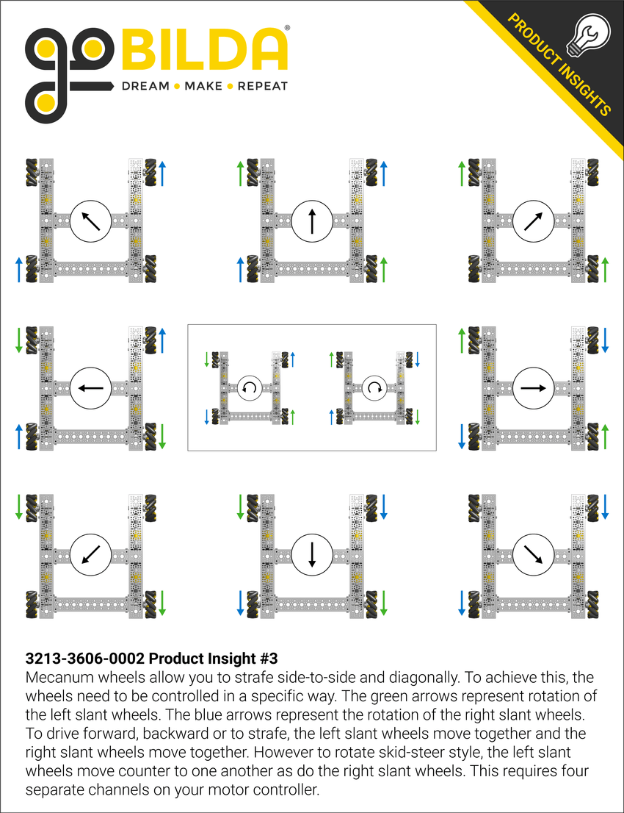

# Mecanum Strafing Autonomous

## What are mecanum wheels?

Mecanum wheels spin at a 45o degree angle and are oriented in such a way that allows sideways and diagonal movement.

Here is a diagram of the different ways we can power motors and the resulting direction the robot will move.

## How do we strafe with them?

As we can see in the diagram, when a positive power is applied, the front right and back left wheels move the robot forward and to the left. The front left and back right are the flipped and when a positive power is applied, they push the robot forward and to the right.

So, if we apply a positive power to the front left and back right motors while applying a negative power to the front left and back right motors, the robot will move to the left without moving forward or backward.

This is a difficult concept to understand with just words, so let's give it a shot. Using the information described above, try and make the robot strafe right for 3 seconds. There is a solution below.

    
Solution

    

