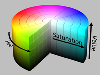

# Easy Open CV: Color

|Table of Contents|
|-|
|[Color Spaces](#color-spaces)|
|[Transformations](#transformation)|
|[Thresholding](#thresholding)|
|[Tasks](#tasks)|

### Video
I have since made a youtube video about this [here](https://www.youtube.com/watch?v=ZAQHwe4mX4g&t=1769s&ab_channel=RuckusRobotics) that explains all of this.

### Color Spaces

Color spaces describe the way images are stored. For example, RGB stores each pixel as some mix of Red, Green, and Blue. Whereas HSV stores Hue, Saturation, and Value. There are many different ones, but the most commonly used are RGB, RGBA, and HSV. 

Easy OpenCv inputs images as RGBA.

### Conversion

It's easy to convert color spaces in the pipeline. Use
`Imgproc.cvtColor(input, output, conversionType)`

There are many options for conversion type like:
`Imgproc.COLOR_RGBA2RGB`
`Imgproc.COLOR_RGB2HSV`
`Imgproc.COLOR_RGB2GRAY`

So to convert an image from RGB to HSV
```java
public Mat processFrame(Mat input) {
    Mat hsvMat = new Mat();
    Imgproc.cvtColor(input, hsvMat, Imgproc.COLOR_RGB2HSV);
    return hsvMat;
}
```

### Color Range & Detection

Color detection is often a way that CV is used. This can be easily done in HSV.



We see that the color changes with Hue, so we just have to check for values withtin a range of Hues. 

*Note: EasyOpenCV uses Hue values between 0-180 whereas many other programs use 0-360. So just halve the normal value. Saturation and Value are both between 0-255 and I think that is pretty standard.

Let's say we want to detect any green, we would look between 90 and 150 normally. But for us it will be between 45 and 75.
```java
public Mat processFrame(Mat input) {
    Mat hsvMat = new Mat();
    Mat greenMat = new Mat();

    Imgproc.cvtColor(input, hsvMat, Imgproc.COLOR_RGB2HSV);

    Scalar lowerGreen = new Scalar(45, 80, 80);
    Scalar upperGreen = new Scalar(75, 255, 255);

    Core.inRange(hsvMat, lowerGreen, upperGreen, greenMat);

    return greenMat;
}
```

This pipeline will return a black and white screen. If the pixel is inside the range, it will turn it white, otherwise it will turn it black.

If we want to see the green, we can do it with one line.

```java
Mat masked = new Mat();
Core.bitwise_and(matHSV, matHSV, masked, greenMat);
return masked;
```

This puts color back in the areas that are white, which are the areas that were inside our color range.

**Tolerant & Strict Threshold**

Sometimes people try to avoid lighting issues by filtering it twice. The first one only filters out things that DEFINITELY aren't the color, so the range is pretty broad. Then boost the lighting of the parts that weren't filtered out the first time. Then filter it with narrower parameters so that way lighting quality is somewhat negligible. I've never actually implemented this, so I don't know about its efficacy, however it seems like a good idea. [Resource Here]

### Tasks

Proficient:

- [ ] Make a pipeline that detects red

Advanced:

- [ ] Mask the original color on top