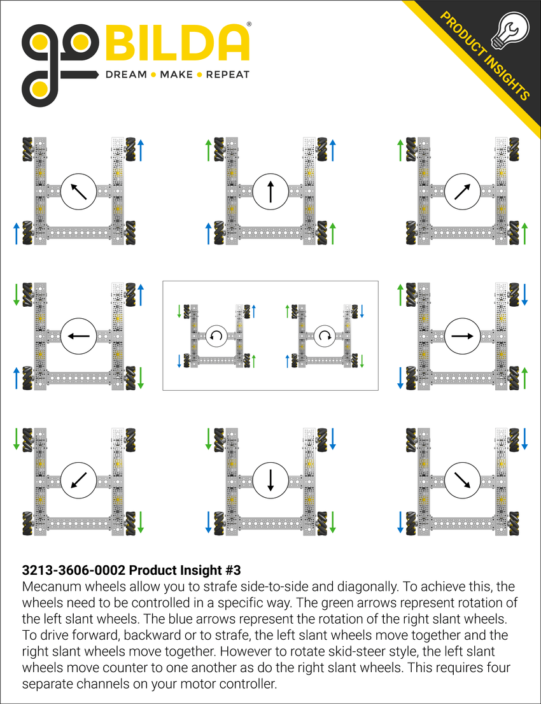

# Mecanum Movement

|Table of Contents|
|-|
|[Kinematics](#kinematics)|
|[Autonomous Tasks](#autonomous-tasks)|
|[TeleOp Tasks](#teleop-tasks)|

### Kinematics

[Optional Video](https://www.youtube.com/watch?v=Xrc0l4TDnyw&t=72s). This guy explains it pretty well and I think it's a good way to understand how they work.

 is a great reference for which wheels need to be powered to move in a certain direction.

### Autonomous Tasks

Do not turn for this task.

Proficient:

- [ ] Drive Forward for 2 seconds
- [ ] Strafe Left for 2 seconds
- [ ] Drive in a square

Advanced:

- [ ] Drive Forward for 10 inches
- [ ] Strafe Left for 10 inches
- [ ] Drive in a 10x10 inch square

### TeleOp Tasks

Proficient:

- [ ] Drive forward/backward using Left Joystick Y
- [ ] Strafe left/right using Left Joystick X
- [ ] Turn using Right Joystick X

Advanced:

- [ ] Be able to use both joysticks at the same time

[Previous Module](Module%204%3A%20Sensors%20and%20Servos.md) | [Next Module](Module%206%3A%20IMU.md)