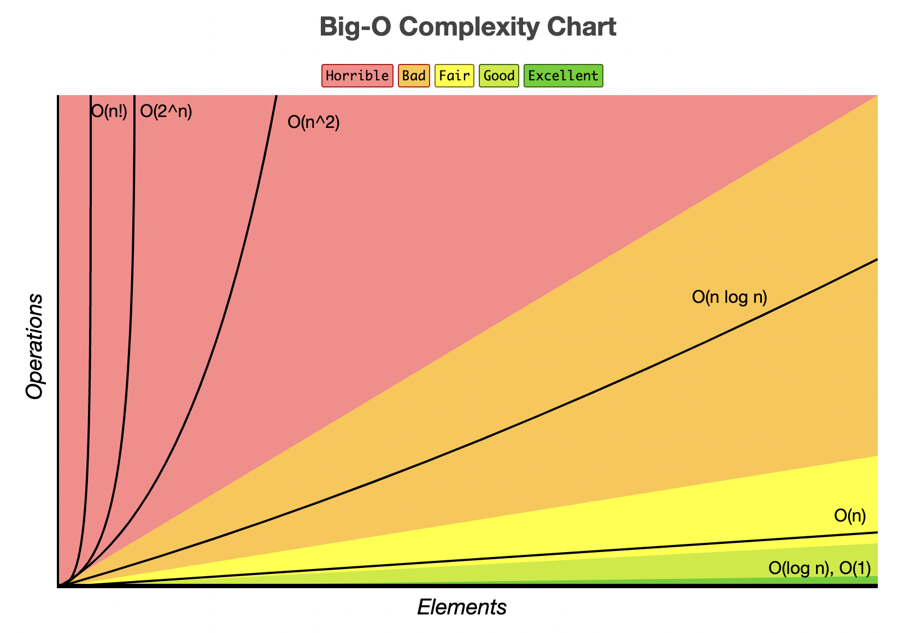

# Intro to Algorithms

## Big O notation

Big O notation is a way for programmers to communicate the efficiency of their programs. Some computers are faster than others, so the runtime of the same program take different amounts of time. Thus, we measure how the runtime scales as the input becomes arbitrarily large. Furthermore, we want to describe how long a program COULD take in the worst case scenario to accurately describe the efficiency of the program. This idea is known as Time Complexity and the way we tell other people is Big O notation as shown below.

O(1) denotes something that takes the same amount of time no matter how large the input is.

O(n) means that if the time and size of the input are proportional and, in the worst case, doubling the the size of the input will roughly double the time.

**Note:** we only care about what happens as the input gets really, really big. If our imaginary functions takes 3n<sup>3</sup> + 100n<sup>2</sup> time, we would write O(n<sup>3</sup>) because as n becomes arbitrarily large, being multiplied by 3 barely changes anything and n<sup>2</sup> also becomes insignificant.



## Practice:

```java
public int findSix(double[] arr) {
    int index = 0;
    for(int i = 0; i < arr.length(); i++) {
        if(arr[i] == 6.0) {
            index = i;
            break;
        }
    }
    return index;
}

double[] array = new double[]{6.0, 3.0, 2.0};
idx = findSix(array);

```

<details>
    <summary>Solution</summary>
    This functions checks each element of the array one by one and looks for the value 6.0. In the worst case scenario, the element is the last item in the array and the function has to check the entire array. So the for loop goes through the entire array, n times. Within the for loop, there are two operation, each constant time, so there are constant time functions happening n times. So our time complexity is n * 2, but when n is really large, it's practically the same as n. So the actual time complexity is O(n).
</details>