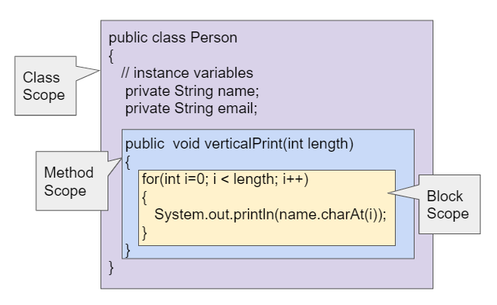

# Scope

### What is scope

Scope is what "level" of the code data exists at. For example,

For instance, variables in the method scope can't be accessed in the class scope because it's at a lower level. However, variables in the class scope can be accessed in the method scope because it's accessing from a higehr level.

### Why is it important

Scope determines where variables can be accessed from. This can be used as a way to avoid errors and accessing the wrong variables. In general, try to declare variables in the lowest scope possible. The main exception is IF that function is being run really really rapidly (like thousands of times per second), then trying to create the variable over and over can make your computer run out of memory or increase the loop time. In that case, then it should probably be declared as a class variable so that it is only created once when the class is instantiated.

### How it works

Class variables are created when the class is created and are stored in memory and are not deleted or cleaned up by garbage collectors. However, method scope variables are created and stored in memory when the method is called and are deleted / cleaned up when the method ends.